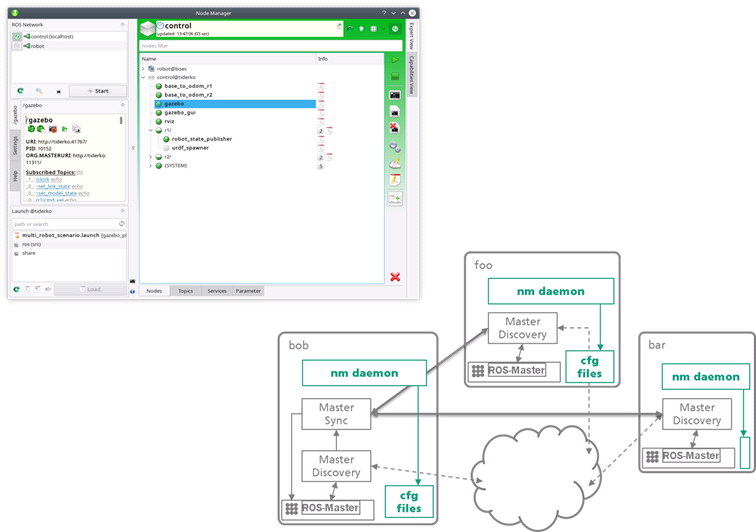

# FKIE multimaster for ROS

The ROS stack of *multimaster_fkie* offers a complete solution for using ROS with multicores.
In addition, Node Manager with a daemon provide a GUI-based management environment that is very useful to manage ROS-launch configurations and control running nodes, also in a single-core system.



## Install

The communication between Node Manager and the daemon is based on python [gRPC](https://grpc.io/). Until Ubuntu *cosmic* you have to install *python-grpcio-tools* from PIP. That's why there are no debian packages for this version of FKIE multimaster. Use follow command line to install all dependencies:

```
cd catkin_ws/src
git clone https://github.com/fkie/multimaster_fkie.git
rosdep update
rosdep install -i --as-root pip:false --reinstall --from-paths multimaster_fkie
```

Than build all packages:
```
catkin build multimaster_fkie
```

## Manual:

* [multimaster_fkie](http://fkie.github.io/multimaster_fkie)
* [discovery](http://fkie.github.io/multimaster_fkie/master_discovery.html) -- `discovery using multicast or zeroconf`
* [synchronization](http://fkie.github.io/multimaster_fkie/master_sync.html) -- `master synchronization`
* [node manager GUI](http://fkie.github.io/multimaster_fkie/node_manager.html) -- `A GUI to manage the configuration on local and remote ROS masters`
* [node manager daemon](http://fkie.github.io/multimaster_fkie/node_manager_daemon.html) -- `Helper node allows an easy (auto)start of remote nodes and manage remote launch files`

For ROS-interfaces and parameterization see [ros_wiki](http://www.ros.org/wiki/multimaster_fkie). For configuration details you can see example launch files of each package.

