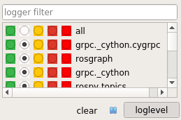

Logscreen
---------

On **Double-Click** on a node the *Node Manager* opens the logfile of the screen in a dockable widget.
Only the last 20 lines are read. With long lines (> 120 characters) it can be less than 20 lines.
But you can scroll up or use **Shift+PageUp** to go to the beginning of the file.
On big files the file reading and formatting can block the *Node Manager*!

- **Remote Nodes**:
    On remote nodes a SSH-connection with **tail -f** will be invoked to read the log file. So you can't scroll to begin of the file!

- **Search**:
    Press **Ctrl+F** to search in shown output.

- **Grep**:
    You can filter the new output. Press **Ctrl+G** and enter the text to filter for. You can also use wildcard character.
    The lines which do not contain the text will be not shown. To see them you need reopen the log!

- **Loglevel**:
    Use sidebar to see the loggers of the node and change their loglevel.
    As long as the logscreen is open it detects the restarts of the node and sets the loglevel again.
    |log_level|

The output in the *logscreen* could be delayed. It depends on how fast the *screen* writes the output to the file.

