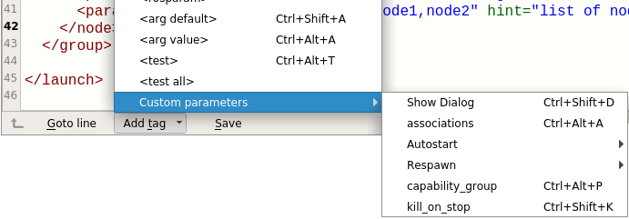
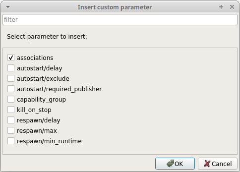

Custom parameter
----------------

Use *Launch Editor* to enter *Node Manager* specific parameter.
In the menu **Add tag/Custom parameters** you find all supported parameter.

|menu|

Or press **Ctrl+Shift+D** to select a parameter from a dialog.

|dialog|

Select one to add the defenition at the current cursor position.

.. caution::
   All of these parameter should be applied to your own ROS-Node **not** to the *Node Manager* node.

