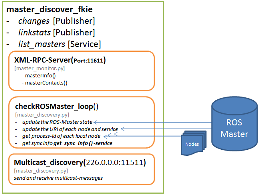

.. master_discovery_fkie documentation master file, created by
   sphinx-quickstart on Tue Apr 30 10:59:19 2013.
   You can adapt this file completely to your liking, but it should at least
   contain the root `toctree` directive.

Welcome to master_discovery_fkie's documentation!
=================================================

A Node to discovery the running ROS Masters in local network. The 
discovering is done by send a echo heartbeat messages to a defined 
multicast group.

Additionally the current state of the ROS Master and local ROS Nodes 
will be offered using XML-RPC server created in :mod:`master_discovery_fkie.master_monitor`-module.
To reduce the count of accesses the whole ROS Master state is described by 
:mod:`master_discovery_fkie.master_info.MasterInfo`.

`abb:` ``master_discovery_fkie`` node structure

Alternatively the :mod:`master_discovery_fkie.zeroconf` can be used to detect ROS Masters using the
avahi-zeroconf deamon.

Contents:

.. toctree::
  :maxdepth: 2

  modules

Indices and tables
==================

* :ref:`genindex`
* :ref:`modindex`
* :ref:`search`

